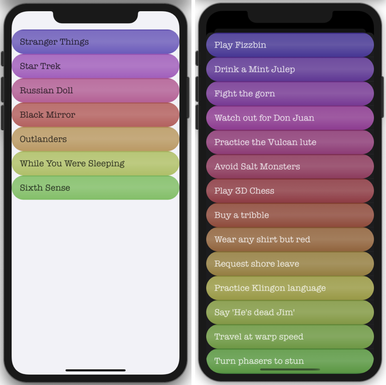

# Animate To Do

Colorful animated list of To Do items.

 \

**Technical Info:** \
Xcode 11 project written in Swift 5 for iOS\
tableView, gradient layers, rounded corners, DispatchQueue, layers\
UIView.animate, CGAffineTransform, spring transitions, array of tuples, color schemes

**See Also:** \
[Quickies - a variety of example iOS apps](https://github.com/PepperoniJoe/Quickies)\
 [Make Icons Swiftly - used to generate app icon sets
 ](https://github.com/PepperoniJoe/Make-Icons-Swiftly)

**Author:** \
Marcy Vernon [@MarcyVernon](https://twitter.com/MarcyVernon)

**License:** \
"Animate To Do" is under the MIT license. See [LICENSE](/LICENSE) for more information.
