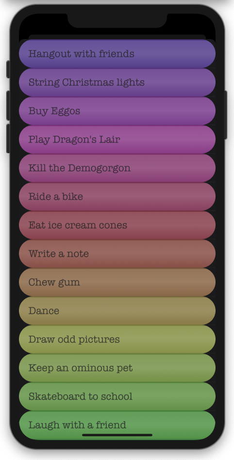
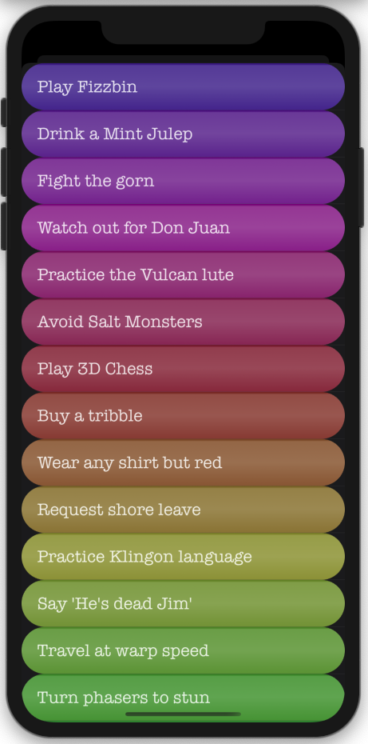

# Animate To Do
Colorful animated list of To Do items.

*Another Example* \

**Technical Info:** \
Xcode 11 project written in Swift 5 for iOS

**Author:** \
Marcy Vernon [@MarcyVernon](https://twitter.com/MarcyVernon)

**License:** \
"Animate To Do" is under the MIT license. See [LICENSE](/LICENSE) for more information.
